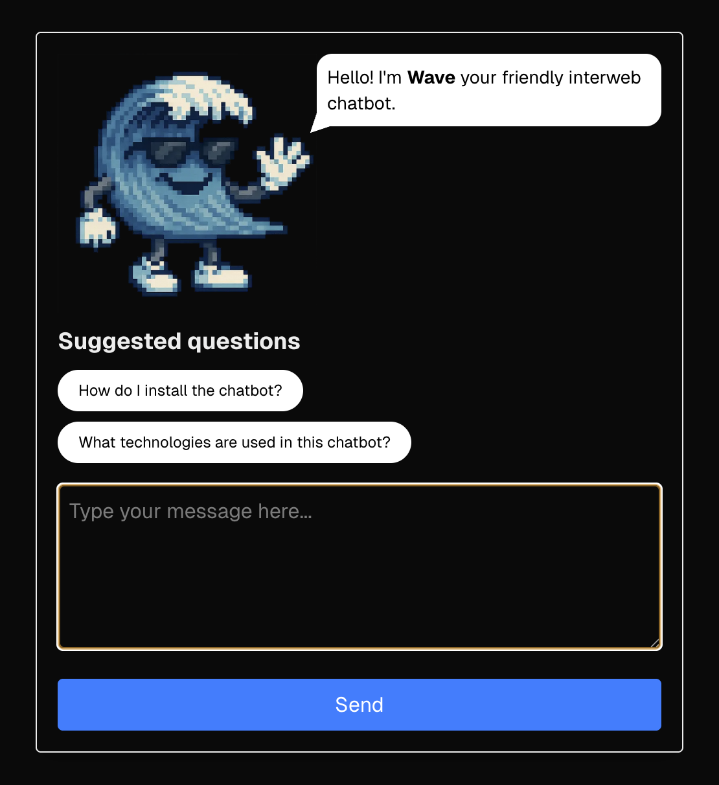

# Wave Chatbot 🌊

A modern, interactive chatbot built with Next.js, TypeScript, and React. Wave is a friendly AI assistant that can answer questions using fuzzy search through a customisable FAQ database.



## Features

- 🤖 **Interactive Chat Interface** - Clean, responsive chat UI with message history
- 🔍 **Fuzzy Search** - Powered by Fuse.js for intelligent question matching
- 🛡️ **Content Filtering** - Built-in profanity filter for safe conversations
- ⌨️ **Keyboard Shortcuts** - Ctrl/Cmd + Enter to send messages quickly
- 💡 **Suggested Questions** - Quick-start buttons for common queries
- 📱 **Responsive Design** - Works seamlessly on desktop and mobile devices
- 🎨 **Modern UI** - Built with Tailwind CSS for sleek styling

## Tech Stack

- **Frontend**: Next.js 15, React 19, TypeScript
- **Styling**: Tailwind CSS
- **Search**: Fuse.js for fuzzy string matching
- **Content Safety**: bad-words library for profanity filtering
- **Development**: ESLint, Prettier, Husky for code quality

## Getting Started

### Prerequisites

- Node.js 18 or later
- npm, yarn, or pnpm

### Installation

1. **Clone the repository**

   ```bash
   git clone git@github.com:garydavisonos/wave-chatbot.git
   cd wave-chatbot
   ```

2. **Install dependencies**

   ```bash
   npm install
   # or
   yarn install
   # or
   pnpm install
   ```

3. **Run the development server**

   ```bash
   npm run dev
   # or
   yarn dev
   # or
   pnpm dev
   ```

4. **Open your browser**
   Navigate to [http://localhost:3000](http://localhost:3000) to see the chatbot in action.

## Usage

### Basic Chat

- Type your question in the textarea
- Press Enter or click "Send" to submit
- Use Ctrl/Cmd + Enter for quick sending
- View conversation history in the message log

### Suggested Questions

Click on any suggested question button to quickly populate the input field with common queries.

### Customising Responses

The chatbot's knowledge base is stored in `src/data/data.json`. Each entry should follow this structure:

```json
{
  "question": "Your question here",
  "answer": "The corresponding answer"
}
```

The fuzzy search will match user inputs to questions even with typos or variations in wording.

## Project Structure

```
wave-chatbot/
├── public/
│   └── wave.png              # Chatbot avatar image
├── src/
│   ├── app/
│   │   ├── globals.css       # Global styles
│   │   ├── layout.tsx        # Root layout component
│   │   ├── page.tsx          # Home page
│   │   └── resources/blocks/
│   │       └── ChatBot.tsx   # Main chatbot component
│   ├── data/
│   │   └── data.json         # FAQ database
│   └── pages/api/
│       └── chat.ts           # API endpoint for chat processing
├── eslint.config.mjs         # ESLint configuration
├── next.config.ts            # Next.js configuration
├── package.json              # Dependencies and scripts
├── postcss.config.mjs        # PostCSS configuration
└── tsconfig.json            # TypeScript configuration
```

## Configuration

### Search Settings

Modify the Fuse.js configuration in `src/pages/api/chat.ts`:

```typescript
const fuse = new Fuse(data, {
  keys: ["question", "answer"], // Fields to search
  threshold: 0.4, // Match sensitivity (0-1)
});
```

### Content Filtering

The bad-words filter can be customised by modifying the Filter instance in `ChatBot.tsx`.

## Contributing

We welcome contributions! Here's how you can help:

1. **Fork the repository**
2. **Create a feature branch**
   ```bash
   git checkout -b feature/amazing-feature
   ```
3. **Make your changes**
4. **Run tests and linting**
   ```bash
   npm run lint
   ```
5. **Commit your changes**
   ```bash
   git commit -m 'Add amazing feature'
   ```
6. **Push to the branch**
   ```bash
   git push origin feature/amazing-feature
   ```
7. **Open a Pull Request**

### Development Guidelines

- Follow TypeScript best practices
- Use ESLint and Prettier for code formatting
- Write descriptive commit messages
- Test your changes thoroughly
- Update documentation as needed

## Extending the Chatbot

### Adding New Questions

1. Edit `src/data/data.json`
2. Add new question-answer pairs
3. The fuzzy search will automatically include them

### Customising the UI

- Modify `ChatBot.tsx` for component changes
- Update `globals.css` for styling changes
- Tailwind classes can be adjusted throughout the component

## Browser Support

Wave Chatbot supports all modern browsers including:

- Chrome (latest)
- Firefox (latest)
- Safari (latest)
- Edge (latest)

## License

This project is open source and available under the [MIT License](LICENSE).

## Support

If you encounter any issues or have questions:

- Check the existing issues on GitHub
- Create a new issue with detailed information
- Contribute to discussions in the community

---

Built with ❤️ using Next.js and TypeScript
